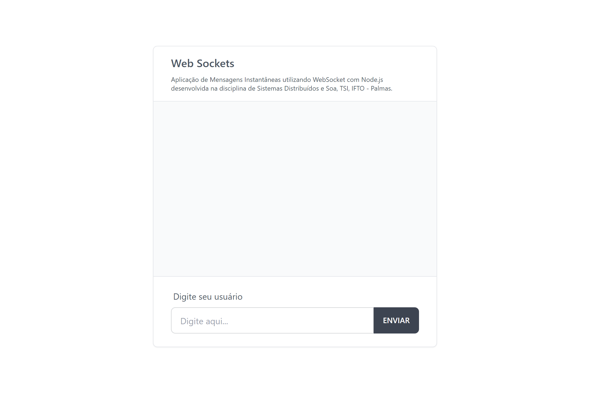
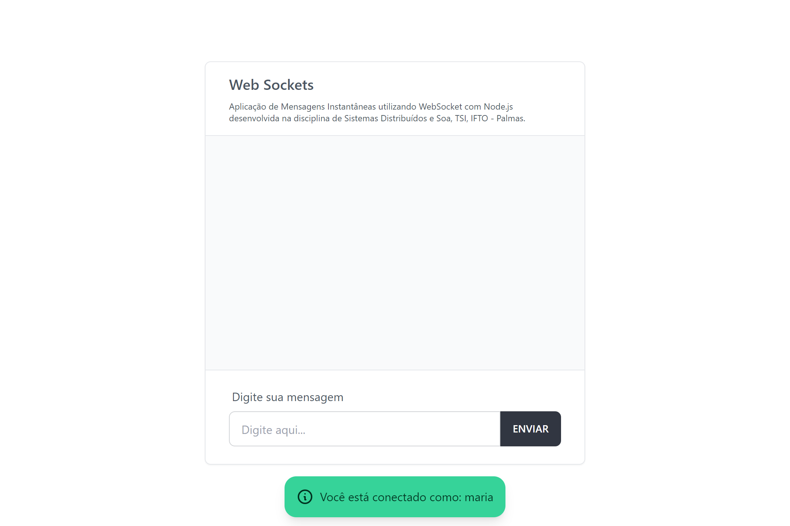
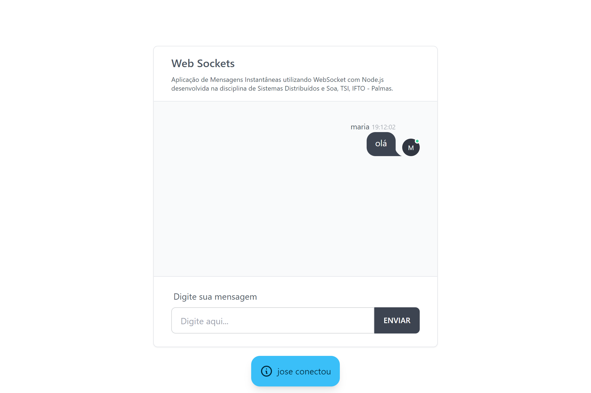
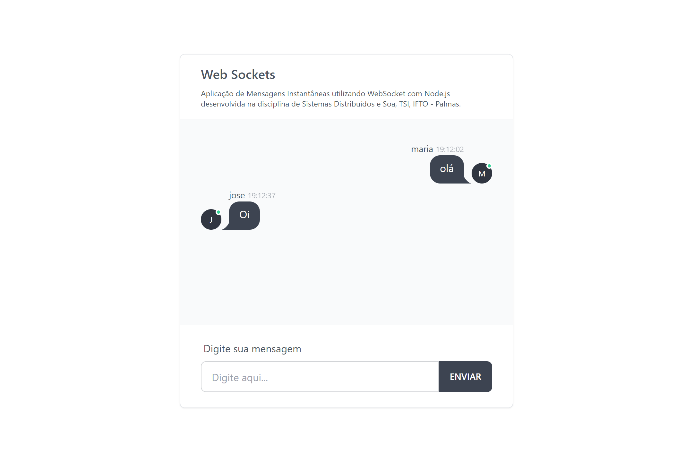
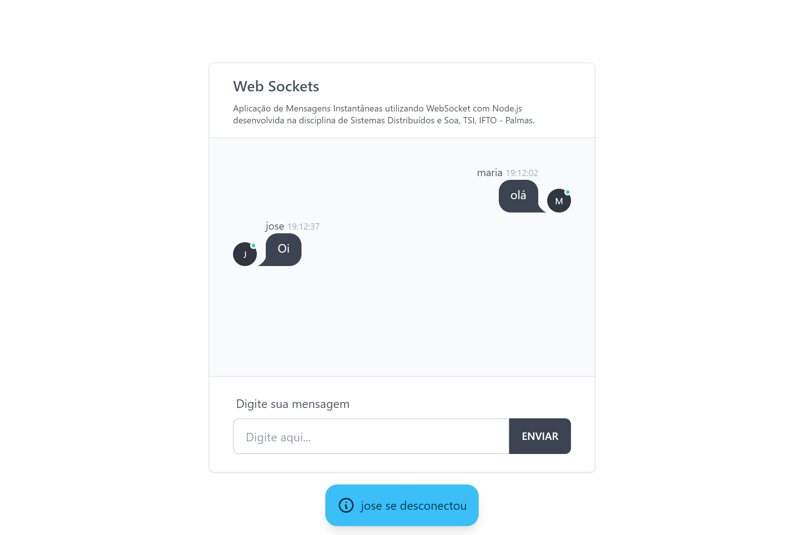

<h1 align="center" id="title">Sistemas Distribuídos e Soa - Web Sockets</h1>

<p align="center"></p>

<p id="description">Aplicação de Mensagens Instantâneas utilizando WebSocket com Node.js desenvolvida na disciplina de Sistemas Distribuídos e Soa TSI IFTO - Palmas.</p>

<p align="center"></p>

<h2>🚀 Demonstação</h2>

[https://sds-websockets.onrender.com/](https://sds-websockets.onrender.com/)

<h2>📷 Visualização</h2>






<h2>🧐 Funcionalidades</h2>

Aqui estão algumas das melhores características do projeto:

*   Identificação do usuário
*   Envio e recebimento de mensagens em tempo real
*   Identificação visual de usuários no chat

<h2>🛠️ Etapas de instalação:</h2>

<p>1. Instalar dependência</p>

```
npm install
```

<p>2. Iniciar aplicação</p>

```
npm start
```

<p>3. Iniciar aplicação em modo de desenvolvimento</p>

```
npm run watch
```


<h2>💻 Construído com</h2>

Tecnologias usadas no projeto:

*   Node.js
*   Express
*   Socket.IO

<h2>🛡️ Licença:</h2>

Este projeto é licenciado sob o MIT
